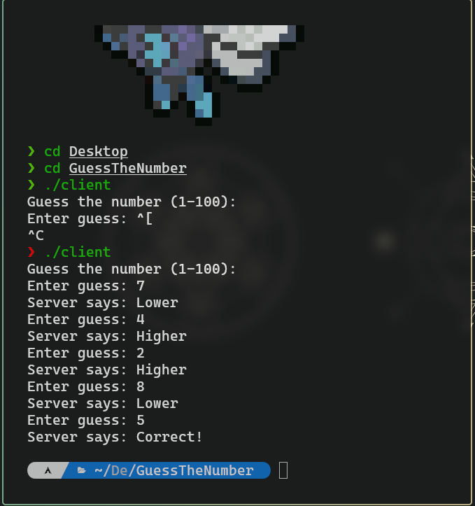
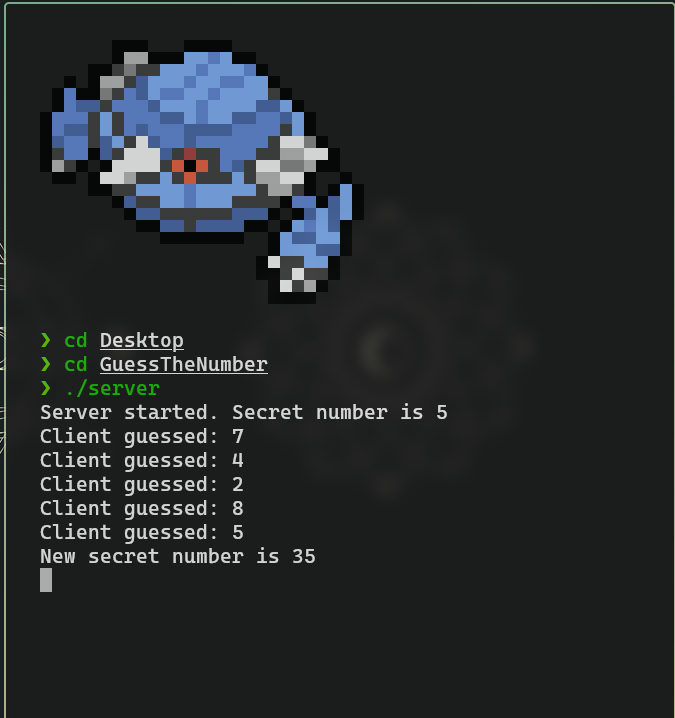

# UDP-Based "Guess the Number" Game in C

## Authors

**_Pasang Tengin Lama, [201722], BE Software  (Day)_**
**_Dikshit Sapkota, [201747], BE Software  (Day)_**
**_Krinjal Paudel, [201715], BE Software  (Day)_**


---

##  Brief Project Description

_This project implements a lightweight **UDP-based number guessing game** using the C programming language and socket programming concepts. It is designed to demonstrate basic client-server communication over the User Datagram Protocol (UDP), with a focus on simplicity and correctness._

The **server** generates a random number between 1 and 100, and the **client** attempts to guess it. After each guess, the server provides feedback: **"Higher"**, **"Lower"**, or **"Correct!"**. Once the correct number is guessed, the server resets and starts a new game automatically.

---

##  Features

- **UDP Communication:** The game uses connectionless UDP sockets to transmit data between the client and server.
- **Client-Server Model:** A central server accepts guesses and responds; the client interacts via terminal.
- **Lightweight Protocol:** Simple, plain-text messages are exchanged for clarity and debugging.
- **Game Reset:** After a successful guess, the server regenerates a number for a new round without restarting the application.
- **Stateless Handling:** Since UDP is connectionless, the server handles each guess independently.
- **Command-line Interface:** Both server and client applications run from the terminal.

---

##  Dependencies

- **Compiler:** GCC or any standard C compiler.
- **Header Files:** `stdio.h`, `stdlib.h`, `string.h`, `unistd.h`, `arpa/inet.h`, `sys/socket.h`, `time.h


---

## How to Compile

1. **Save the code files:**
   - `server.c` for the UDP server
   - `client.c` for the UDP client

2. **Open a terminal** in the directory where the files are saved.

3. **Compile the server:**

```bash
  gcc server.c -o server
```


 4. **Compile the server:**
```bash
gcc client.c -o client
```

## How to Run 
1. **Start the Server:**
 - Open a terminal/command prompt and run the compiled server executable:
```bash
. /server
```

2. **Start Client:**
 - open a terminal/command prompt and run the compiled client executable:
```bash
   ./client
```
  ##Screenshots

---

 **Here are some screenshots illustrating the chat application in action**

- A view of the client console:  
  

- A view of the server console:  
  

